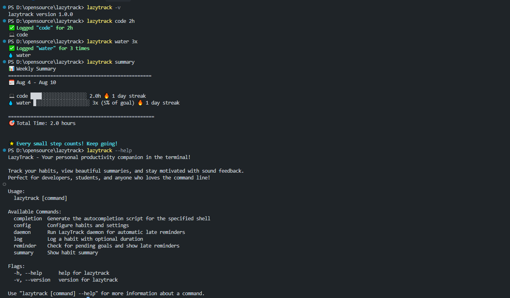
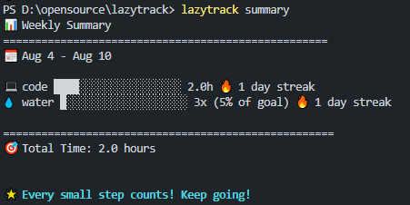
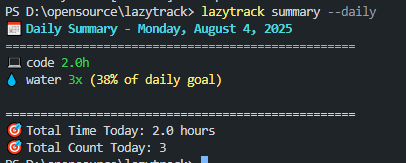
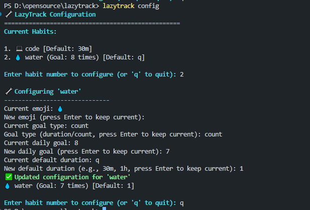

# LazyTrack 🚀

A fun, visually appealing, and feature-rich **CLI-based time/habit tracker** written in Go. Perfect for developers, students, and anyone who loves the command line!


## 📊 Screenshots

### Demo


### Weekly Summary


### Daily Summary  


### Configuration


## ✨ Features

- **🎯 Simple Habit Logging**: Log habits with time or count tracking
- **📊 Beautiful Summaries**: ASCII-based weekly/daily activity reports with bar charts
- **🎨 Custom Emojis**: Personalize each habit with custom emoji icons
- **🎯 Goal Tracking**: Set daily goals and track progress
- **⚙️ Easy Configuration**: Interactive setup and customization
- **🔥 Streak Tracking**: Monitor your consistency
- **💾 Local Storage**: JSON-based data storage for data persistence
- **🌙 Automatic Late Reminders**: Get notified after 8 PM for pending goals

## 🚀 Quick Start

### Installation

#### Option 1: Package Managers (Recommended)

**Homebrew (macOS/Linux):**
```bash
# Add the tap
brew tap master-wayne7/homebrew-tap

# Install LazyTrack
brew install lazytrack
```

**Chocolatey (Windows):**
```powershell
# Install LazyTrack
choco install lazytrack
```

#### Option 2: Download Pre-built Binary

**Windows:**
```powershell
# Download the latest release
Invoke-WebRequest -Uri "https://github.com/master-wayne7/lazytrack/releases/latest/download/lazytrack_Windows_x86_64.zip" -OutFile "lazytrack.zip"
Expand-Archive lazytrack.zip -DestinationPath .
```

**macOS:**
```bash
# Download the latest release
curl -L -o lazytrack "https://github.com/master-wayne7/lazytrack/releases/latest/download/lazytrack_Darwin_x86_64.tar.gz"
tar -xzf lazytrack_Darwin_x86_64.tar.gz
chmod +x lazytrack

# Add to PATH (optional)
sudo cp lazytrack /usr/local/bin/
```

**Linux:**
```bash
# Download the latest release
curl -L -o lazytrack "https://github.com/master-wayne7/lazytrack/releases/latest/download/lazytrack_Linux_x86_64.tar.gz"
tar -xzf lazytrack_Linux_x86_64.tar.gz
chmod +x lazytrack

# Add to PATH (optional)
sudo cp lazytrack /usr/local/bin/
```

#### Option 3: Build from Source

1. **Clone the repository**:
   ```bash
   git clone https://github.com/master-wayne7/lazytrack.git
   cd lazytrack
   ```

2. **Install dependencies**:
   ```bash
   go mod tidy
   ```

3. **Build the application**:
   ```bash
   go build -o lazytrack
   ```

4. **Add to your PATH** (optional):
   ```bash
   # On macOS/Linux
   sudo cp lazytrack /usr/local/bin/
   
   # On Windows (PowerShell as Administrator)
   Copy-Item lazytrack.exe C:\Windows\System32\
   ```

### Basic Usage

```bash
# Log a habit with default duration (30m)
lazytrack code

# Log a habit with specific duration
lazytrack code 2h
lazytrack walk 30m
lazytrack read 1h30m

# Log count-based habits
lazytrack water 8x
lazytrack exercise 3times

# View your weekly summary
lazytrack summary

# View daily summary
lazytrack summary --daily

# Configure habits
lazytrack config

# Check for pending goals
lazytrack reminder

# Run automatic late reminders
lazytrack daemon
```

## 📖 Detailed Usage

### Logging Habits

LazyTrack supports both time-based and count-based habits:

**Time-based habits:**
```bash
lazytrack code 2h          # 2 hours of coding
lazytrack walk 30m         # 30 minutes of walking
lazytrack read 1h30m       # 1 hour 30 minutes of reading
lazytrack meditate 45m      # 45 minutes of meditation
```

**Count-based habits:**
```bash
lazytrack water 8x         # 8 glasses of water
lazytrack exercise 3times  # 3 exercise sessions
lazytrack pushups 50x      # 50 pushups
```

**Default duration:**
```bash
lazytrack code             # Logs 30 minutes (default)
lazytrack read             # Logs 30 minutes (default)
```

### Viewing Summaries

**Weekly Summary:**
```bash
lazytrack summary
```

Example output:
```
📊 Weekly Summary
==================================================
📅 Jan 15 - Jan 21

💻 code ██████████████████ 12.5h (125% of goal) 🔥 5 day streak
💧 water ████████████████ 49x (87% of goal) 🔥 7 day streak
📖 read ██████ 4.2h (60% of goal) 🔥 3 day streak

==================================================
🎯 Total Time: 16.7 hours

🚀 Great progress! You're so close to your goals!
```

**Daily Summary:**
```bash
lazytrack summary --daily
```

### Configuration

**Interactive Configuration:**
```bash
lazytrack config
```

**Command-line Configuration:**
```bash
# Set emoji for a habit
lazytrack config --habit code --emoji 💻

# Set daily goal
lazytrack config --habit water --goal 8 --type count
lazytrack config --habit read --goal 2 --type duration

# Set default duration
lazytrack config --habit code --duration 1h
```

### Reminders and Notifications

**Check Pending Goals:**
```bash
lazytrack reminder
```

**Late Reminders (after 8 PM):**
```bash
lazytrack reminder --late
```

**Automatic Daemon:**
```bash
# Run daemon in foreground (checks every hour)
lazytrack daemon

# Set up automatic startup (Windows)
scripts/setup_daemon.bat
```

The daemon automatically:
- Checks for pending goals every hour
- Shows late reminders after 8 PM
- Displays popup notifications for pending goals
- Runs in the background for continuous monitoring

## 🎨 Features in Detail

### Notifications and Reminders

LazyTrack provides notifications for:
- ✅ **Success**: When a habit is logged (console only)
- 🎉 **Goal Achievement**: When daily goals are reached (console only)
- 🌙 **Late Reminders**: Automatic notifications after 8 PM for pending goals
- 📋 **Goal Reminders**: Check pending goals anytime

The app automatically detects your platform and uses appropriate notification methods:
- **macOS**: Uses `osascript` for native notifications
- **Linux**: Uses `notify-send`, `zenity`, or `kdialog`
- **Windows**: Uses PowerShell with `System.Windows.Forms.NotifyIcon`

### Visual Summaries

- **Bar Charts**: ASCII-based progress visualization
- **Emoji Icons**: Custom emojis for each habit
- **Progress Percentages**: Goal completion tracking
- **Streak Tracking**: Daily consistency monitoring
- **Colorful Output**: Terminal colors for better UX

### Goal Tracking

Set daily goals for any habit:
- **Duration Goals**: "Read 2 hours per day"
- **Count Goals**: "Drink 8 glasses of water per day"

### Data Storage

- **JSON Files**: Stored in `~/.lazytrack/` (macOS/Linux) or `%USERPROFILE%\.lazytrack\` (Windows)
- **Files**: `habits.json`, `logs.json`, `config.json`
- **Automatic Setup**: Creates files on first run
- **Cross-platform**: Works on Windows, macOS, and Linux

## 🛠️ Development

### Project Structure

```
lazytrack/
├── main.go              # Entry point
├── cmd/
│   ├── log.go          # Habit logging command
│   ├── summary.go      # Summary display command
│   └── config.go       # Configuration command
├── types/
│   └── types.go        # Data models
├── store/
│   └── store.go        # Database operations
├── parser/
│   └── parser.go       # Duration parsing
├── sound/
│   └── sound.go        # Cross-platform sound
├── summary/
│   └── summary.go      # Summary calculations
└── README.md
```

### Building

```bash
# Build for current platform
go build -o lazytrack

# Build for specific platforms
GOOS=linux GOARCH=amd64 go build -o lazytrack-linux
GOOS=darwin GOARCH=amd64 go build -o lazytrack-macos
GOOS=windows GOARCH=amd64 go build -o lazytrack-windows.exe
```

### Testing

```bash
# Run all tests
go test ./...

# Run tests with coverage
go test -cover ./...
```

## 🎯 Examples

### Developer Workflow

```bash
# Start your day
lazytrack code 2h
lazytrack water 8x

# Check progress
lazytrack summary

# After lunch
lazytrack read 1h
lazytrack exercise 3x

# End of day
lazytrack summary --daily
```

### Student Workflow

```bash
# Study sessions
lazytrack study 3h
lazytrack homework 2h30m

# Health habits
lazytrack water 10x
lazytrack exercise 1h

# Weekly review
lazytrack summary
```

### Fitness Tracking

```bash
# Workouts
lazytrack gym 1h30m
lazytrack run 45m
lazytrack yoga 1h

# Nutrition
lazytrack water 8x
lazytrack protein 3x

# Check weekly progress
lazytrack summary
```

## 🤝 Contributing

1. Fork the repository
2. Create a feature branch (`git checkout -b feature/amazing-feature`)
3. Commit your changes (`git commit -m 'Add amazing feature'`)
4. Push to the branch (`git push origin feature/amazing-feature`)
5. Open a Pull Request

## 📝 License

This project is licensed under the MIT License - see the [LICENSE](LICENSE) file for details.

## 🙏 Acknowledgments

- Built for GitHub's "For the Love of Code" hackathon
- Inspired by the need for simple, terminal-based productivity tools
- Thanks to the Go community for excellent libraries

---

**Made with ❤️ for the terminal community** 